😄 Pronouns: He/ Him

🌱 Currently learning: Web3 & NestJS 

💬 Conversation starters: Web3, Linux, Digital gardens

⚡ Fun fact: I listen to [Danheim](https://danheimmusic.com/) when I code

#### Languages

  
  
  

#### Frameworks 

  
  
  
  
  

#### Tools

    
  
  
    
  
  
  
  
 

### My GitHub Stats

 

 
 

  

<!--  https://simpleicons.org/ -->
<!-- https://shields.io/ -->
